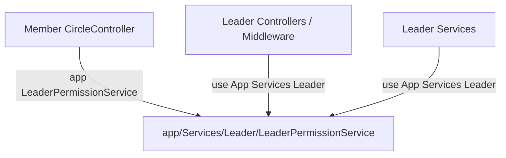
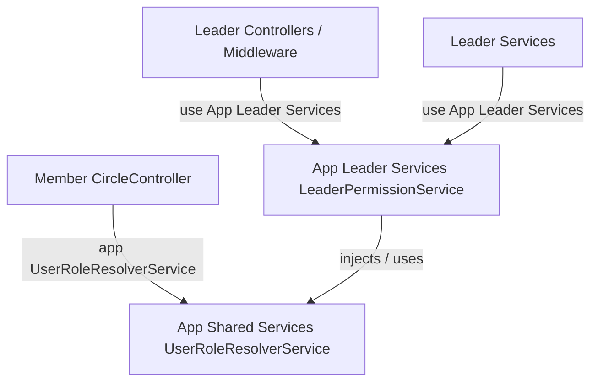

# PHASE L4-A — LEADER PERMISSION BOUNDARY DESIGN AUDIT

**Document:** `docs/LEADER_MIGRATION_L4A_DESIGN.md`  
**Date:** 2026-09-10  
**Status:** **L4-A STATUS: READY FOR IMPLEMENTATION**  
**Audit Type:** Pure Read-Only Architecture & Boundary Design Audit  
**Target Codebase:** PHP 8.2 / Laravel 12 (Modular Monolith)

---

## 1. Executive Summary

During Phase L2 and L3 of the Leader module extraction, all 40 Leader controllers, services, requests, middleware, and models were cleanly relocated into `app/Leader/`. However, one intentional legacy bridge was maintained:

```text
Member CircleController (app/Http/Controllers/Api/CircleController.php)
    ↓
app/Services/Leader/LeaderPermissionService.php
```

[`CircleController::join`](file:///c:/unity-app 27-5-2026/unity-app - Copy/app/Http/Controllers/Api/CircleController.php#L215) directly invokes `app(LeaderPermissionService::class)->resolveUserRole($user)` to auto-approve circle join requests for `superAdmin` and `countryDirector`.

This Phase L4-A audit investigated:
1. Every method, dependency, and query inside [`LeaderPermissionService.php`](file:///c:/unity-app 27-5-2026/unity-app - Copy/app/Services/Leader/LeaderPermissionService.php).
2. All 32 call sites across the codebase.
3. The exact minimum requirements of `CircleController`.
4. The extraction design for a minimal, zero-bloat shared service: [`App\Shared\Services\UserRoleResolverService`](file:///c:/unity-app 27-5-2026/unity-app - Copy/app/Shared/Services/UserRoleResolverService.php).
5. The subsequent clean relocation of `LeaderPermissionService` to [`App\Leader\Services\LeaderPermissionService`](file:///c:/unity-app 27-5-2026/unity-app - Copy/app/Leader/Services/LeaderPermissionService.php) and the final removal of the legacy `app/Services/Leader/` folder.

**Finding:** The cross-product boundary can be cleanly separated with **zero behavioral change**, **zero database modifications**, and **zero API contract alterations**.

---

## 2. LeaderPermissionService Method Inventory

[`app/Services/Leader/LeaderPermissionService.php`](file:///c:/unity-app 27-5-2026/unity-app - Copy/app/Services/Leader/LeaderPermissionService.php) is a 752-line class with **13 public methods** (0 protected/private methods, 0 constructor dependencies).

| Method | Signature | Classification | Description & DB Interactions |
| :--- | :--- | :--- | :--- |
| `getCapabilitiesMetadata()` | `(): array` | **B: Leader-specific** | Static array of 12 Leader capability definitions (ID, Name, Category, Description). No DB calls. |
| `getDefaultRoleCapabilities()` | `(): array` | **B: Leader-specific** | Default capability maps for the 12 standard leadership roles. No DB calls. |
| `normalizeRoleKey()` | `(string $rawRole): string` | **A: Shared Core** | Pure string normalization mapping variants (`super_admin`, `eed`, `ded`, `id`, `cf`, `cd`, committee chair titles) to canonical camelCase keys. |
| `isLeaderRole()` | `(string $rawRole): bool` | **A: Shared Core** | Checks if raw/normalized role matches one of the 12 recognized leadership roles. |
| `isLeader()` | `(User $user): bool` | **A: Shared Core** | Resolves user's role via `resolveUserRole($user)` and returns boolean `is_leader`. |
| `getRoleLabel()` | `(string $canonicalRole): string` | **A: Shared Core** | Maps canonical role key to human-readable string (e.g. `'Super Admin'`, `'Country Director'`, `'Peer Member'`). |
| `ROLE_HIERARCHY_RANK` | `const array` | **A: Shared Core** | Hierarchy weighting array ranking roles from 100 (`superAdmin`) to 20 (`secretary`). |
| `resolveUserRole()` | `(User $user): array` | **A: Shared Core** | Master role resolution checking: `AdminUser`, `AdminAccess`, `User::$role`, `admin_user_roles` + `roles`, `circles` founder/director/chair/calendar JSON, `circle_members`, `admin_ded_districts`, and `industry_director_assignments`. |
| `resolveRegionalScope()` | `(string $role): string` | **A: Shared Core** | Resolves scope label (`'Global Scope'`, `'Country Scope'`, `'District Scope'`, `'Industry Scope'`, `'Own Circle'`). |
| `getEnabledCapabilitiesForRole()` | `(string $roleKey): array` | **B: Leader-specific** | Queries `leader_role_capabilities` table for overrides, then `roles` + dynamic RBAC tables, falling back to defaults. |
| `resolveCapabilitiesFromDynamicRbac()` | `(Role $role): array` | **B: Leader-specific** | Queries `role_module_access`, `admin_modules`, `role_page_permissions`, `admin_pages`, `permissions`, `role_data_scope`. |
| `resolvePermissionMatrix()` | `(string $role): array` | **B: Leader-specific** | Evaluates enabled capabilities into the 21-flag boolean permission matrix. |
| `resolveManagedCircles()` | `(User $user, string $role): array` | **B: Leader-specific** | Queries `circles` filtered by role scope (`AdminCircleScope::getDedCircleIds`, founder/director/chair IDs). |

---

## 3. Complete Call-Site Inventory

There are **32 total references** to `LeaderPermissionService` and its methods across the repository:

### A. Non-Leader (Member Module) — 1 Call Site
| File | Class / Method | Invocation | Purpose |
| :--- | :--- | :--- | :--- |
| `app/Http/Controllers/Api/CircleController.php:215-216` | `CircleController@join` | `$permissionService = app(LeaderPermissionService::class);`<br>`$roleInfo = $permissionService->resolveUserRole($user);` | Checks `in_array($roleInfo['role'], ['superAdmin', 'countryDirector'], true)` for circle join auto-approval. |

### B. Leader Module Callers — 31 Call Sites
| File | Class / Method | Methods Called | Purpose |
| :--- | :--- | :--- | :--- |
| `app/Leader/Controllers/LeaderCircularsController.php` | `@store`, `@getRecipients` | `resolveUserRole` | Scopes circular recipients based on user role. |
| `app/Leader/Controllers/LeaderFinanceController.php` | `@recordOfflinePayment` | `resolveUserRole` | Validates role for payment recording. |
| `app/Leader/Controllers/LeaderNotificationsController.php` | `@notifications` | `resolveUserRole` | Scopes notification feeds. |
| `app/Leader/Controllers/LeaderPeersController.php` | `@show`, `@index` | `resolveUserRole`, `getEnabledCapabilitiesForRole` | Checks peer view/edit permissions. |
| `app/Leader/Middleware/EnsureLeaderUser.php` | `@handle` | `isLeader` | Gatekeeper middleware for Leader routes. |
| `app/Leader/Middleware/CheckLeaderCapability.php` | `@handle` | `resolveUserRole`, `resolvePermissionMatrix`, `getEnabledCapabilitiesForRole` | Capability check middleware (`leader.can:capability`). |
| `app/Leader/Services/LeaderAuthService.php` | `@sendOtp`, `@verifyOtp`, `@profile` | `isLeader`, `resolveUserRole`, `resolvePermissionMatrix`, `resolveManagedCircles` | Core Leader authentication and profile assembly. |
| `app/Leader/Services/LeaderDashboardService.php` | `@getMetrics`, `@getPlatformOverview` | `resolveUserRole` | Determines metrics scope (platform vs circle). |
| `app/Leader/Services/LeaderFinanceService.php` | `@getTransactions` | `resolveUserRole` | Scopes transaction visibility. |
| `app/Leader/Services/LeaderPeersService.php` | `@getPeers`, `@getPeerDetail`, `@updatePeer` | `resolveUserRole`, `getEnabledCapabilitiesForRole` | Scopes peer lists and validates peer modifications. |
| `app/Leader/Services/LeaderReportsService.php` | `@submitWeeklyReport` | `resolveUserRole` | Verifies reporting authorization. |
| `app/Leader/Services/LeaderRoleMatrixService.php` | `@getMatrix`, `@updateMatrix` | `getCapabilitiesMetadata`, `getDefaultRoleCapabilities`, `getEnabledCapabilitiesForRole` | Super Admin role-capability matrix administration. |
| `app/Leader/Services/LeaderTeamsService.php` | `@getCircles`, `@getCircleSummary` | `resolveUserRole` | Scopes circle directories and leadership teams. |

---

## 4. CircleController Dependency Analysis

### Exact Need in CircleController:
Lines 213–221 of [`CircleController.php`](file:///c:/unity-app 27-5-2026/unity-app - Copy/app/Http/Controllers/Api/CircleController.php#L213-L221):
```php
// Auto-approve join requests for super admins and country directors
if ($user) {
    $permissionService = app(LeaderPermissionService::class);
    $roleInfo = $permissionService->resolveUserRole($user);
    if (in_array($roleInfo['role'], ['superAdmin', 'countryDirector'], true)) {
        $status = 'approved';
        $joinedAt = now();
    }
}
```

### Key Findings:
1. **Inputs:** `$user` (`App\Models\User`).
2. **Output Consumed:** `$roleInfo['role']` (string canonical key).
3. **Capability Logic Needed:** **NONE**. `CircleController` does not use capabilities, permission matrices, circulars, reports, or financial settings.
4. **Conclusion:** `CircleController` requires only **generic user role resolution**, which is fundamentally cross-cutting domain infrastructure, not Leader-specific business logic.

---

## 5. Shared Core vs Leader Boundary Design

```text
┌────────────────────────────────────────────────────────────────────────┐
│               App\Shared\Services\UserRoleResolverService              │
│  (Shared cross-product infrastructure - No Leader capability logic)   │
├────────────────────────────────────────────────────────────────────────┤
│ + ROLE_HIERARCHY_RANK: const array                                    │
│ + normalizeRoleKey(string $rawRole): string                            │
│ + isLeaderRole(string $rawRole): bool                                  │
│ + isLeader(User $user): bool                                           │
│ + getRoleLabel(string $canonicalRole): string                          │
│ + resolveRegionalScope(string $role): string                           │
│ + resolveUserRole(User $user): array                                   │
└──────────────────────────────────┬─────────────────────────────────────┘
                                   │
                 ┌─────────────────┴─────────────────┐
                 │                                   │
                 ▼                                   ▼
┌──────────────────────────────────┐┌──────────────────────────────────┐
│         Member Module            ││          Leader Module           │
│   (App\Http\Controllers\Api\     ││    (App\Leader\Services\         │
│        CircleController)         ││     LeaderPermissionService)     │
├──────────────────────────────────┤├──────────────────────────────────┤
│ - Calls:                         ││ - Extends / Injects              │
│   UserRoleResolverService        ││   UserRoleResolverService        │
│   ->resolveUserRole($user)       ││ - Leader-specific capabilities:  │
│ - Uses:                          ││   + getCapabilitiesMetadata()    │
│   $roleInfo['role']              ││   + getDefaultRoleCapabilities() │
│ - Zero coupling to Leader module ││   + getEnabledCapabilitiesFor... │
│                                  ││   + resolvePermissionMatrix()    │
│                                  ││   + resolveManagedCircles()      │
│                                  ││   + resolveCapabilitiesFrom...   │
└──────────────────────────────────┘└──────────────────────────────────┘
```

### Responsibility Breakdown:

| Service | Location | Responsibilities | Justification |
| :--- | :--- | :--- | :--- |
| **`UserRoleResolverService`** | `app/Shared/Services/UserRoleResolverService.php` | • Role normalization<br>• Role hierarchy ranking<br>• Primary role detection across `AdminUser`, `User::$role`, `Circle`, `CircleMember`, `admin_ded_districts`, `industry_director_assignments`<br>• Regional scope resolution | Generic identity & role resolution required by multiple domains (Member, Leader, future Admin/Scan). Zero domain capability rules. |
| **`LeaderPermissionService`** | `app/Leader/Services/LeaderPermissionService.php` | • 12 Leader Capabilities definition & defaults<br>• 21-flag permission matrix generation<br>• Dynamic RBAC mapping to capabilities<br>• Circle management / leadership directory resolution<br>• Proxies/delegates `resolveUserRole()` to `UserRoleResolverService` | Domain-specific authorization rules governing the Leader App UI, mobile navigation tabs, report submissions, and financial permissions. |

---

## 6. Dependency Graph

### Current State (Cross-Product Coupling):


### Target L4-B State (Clean Monolith Separation):


---

## 7. Behavior Preservation Requirements

During implementation of L4-B, the following behaviors must remain 100% byte-for-byte equivalent:

1. **Role Resolution Order & Ranking:**
   `superAdmin` (100) > `countryDirector` (90) > `districtExecDirector` (80) > `industryDirector` (70) > `circleDirector` (60) > `circleFounder` (50) > `chairBusinessGrowth` (40) > `chairMembership` (38) > `chairEventsPrograms` (36) > `circleChair` (34) > `viceChair` (30) > `secretary` (20) > `member` (0).
2. **Fast-Path Admin Detection:**
   `AdminUser` with `super_admin` role or `AdminAccess::isGlobalAdmin` / `isSuper` must immediately return `superAdmin` role and `'Global Scope'`.
3. **Database Lookups:**
   Exact SQL queries against `admin_user_roles`, `circles`, `circle_members`, `admin_ded_districts`, and `industry_director_assignments`.
4. **Auto-Approval Contract in CircleController:**
   Only `superAdmin` and `countryDirector` receive instant `status = 'approved'` and `joined_at = now()`. All other users remain `status = 'pending'`.
5. **Leader Permission Matrix:**
   All 21 boolean keys and 12 capability keys must compute identical output.

---

## 8. Test Coverage Audit

| Test Area | Existing Test File | Status | Notes |
| :--- | :--- | :--- | :--- |
| **Leader Endpoints Fixes** | `tests/Feature/LeaderAppEndpointsFixTest.php` | **PASSING** | Tests `verify-otp`, `dashboard/metrics`, `peers` |
| **Member Testimonials** | `tests/Feature/TestimonialApiTest.php` | **PASSING** | 7/7 tests pass |
| **Member Impacts** | `tests/Feature/ImpactApiTest.php` | **PASSING** | 3/3 tests pass |
| **Circle Join Requests (Admin)** | `tests/Feature/CircleJoiningRequestsTest.php` | **PASSING** | Tests admin pending requests & user requests API |
| **CircleController@join (Auto-approval for SuperAdmin/CountryDirector)** | *None specifically asserting `join` auto-approval* | **MISSING TEST** | High priority to verify during L4-B |
| **LeaderPermissionService standalone unit/feature** | *None* | **MISSING TEST** | Direct tests for capability resolution needed in L4-B |

---

## 9. Implementation Plan for Phase L4-B

### Step 1: Create Shared Directory & Service
* **New File:** [`app/Shared/Services/UserRoleResolverService.php`](file:///c:/unity-app 27-5-2026/unity-app - Copy/app/Shared/Services/UserRoleResolverService.php)
* **Namespace:** `App\Shared\Services`
* **Contents:**
  - `declare(strict_types=1);`
  - `public const ROLE_HIERARCHY_RANK`
  - `public function normalizeRoleKey(string $rawRole): string`
  - `public function isLeaderRole(string $rawRole): bool`
  - `public function isLeader(User $user): bool`
  - `public function getRoleLabel(string $canonicalRole): string`
  - `public function resolveRegionalScope(string $role): string`
  - `public function resolveUserRole(User $user): array`

### Step 2: Relocate LeaderPermissionService to Leader Domain
* **Move File:** `app/Services/Leader/LeaderPermissionService.php` → [`app/Leader/Services/LeaderPermissionService.php`](file:///c:/unity-app 27-5-2026/unity-app - Copy/app/Leader/Services/LeaderPermissionService.php)
* **Namespace:** `App\Leader\Services`
* **Dependency:** Injects `UserRoleResolverService` via constructor or delegates directly to `UserRoleResolverService`.
* **Retained Methods:**
  - `getCapabilitiesMetadata()`
  - `getDefaultRoleCapabilities()`
  - `getEnabledCapabilitiesForRole()`
  - `resolveCapabilitiesFromDynamicRbac()`
  - `resolvePermissionMatrix()`
  - `resolveManagedCircles()`
  - Delegate proxy methods: `resolveUserRole()`, `isLeader()`, `isLeaderRole()`, `normalizeRoleKey()`, `getRoleLabel()`, `resolveRegionalScope()` (ensures 100% backward compatibility for all Leader callers).

### Step 3: Update Member CircleController
* **File:** [`app/Http/Controllers/Api/CircleController.php`](file:///c:/unity-app 27-5-2026/unity-app - Copy/app/Http/Controllers/Api/CircleController.php)
* **Change:**
  - Replace `use App\Services\Leader\LeaderPermissionService;` with `use App\Shared\Services\UserRoleResolverService;`.
  - Replace `$permissionService = app(LeaderPermissionService::class);` with `$roleResolver = app(UserRoleResolverService::class);`.
  - Replace `$roleInfo = $permissionService->resolveUserRole($user);` with `$roleInfo = $roleResolver->resolveUserRole($user);`.

### Step 4: Update All Leader Callers
* Update `use App\Services\Leader\LeaderPermissionService;` → `use App\Leader\Services\LeaderPermissionService;` in:
  - `app/Leader/Controllers/LeaderCircularsController.php`
  - `app/Leader/Controllers/LeaderFinanceController.php`
  - `app/Leader/Controllers/LeaderNotificationsController.php`
  - `app/Leader/Controllers/LeaderPeersController.php`
  - `app/Leader/Middleware/CheckLeaderCapability.php`
  - `app/Leader/Middleware/EnsureLeaderUser.php`
  - `app/Leader/Services/LeaderAuthService.php`
  - `app/Leader/Services/LeaderDashboardService.php`
  - `app/Leader/Services/LeaderFinanceService.php`
  - `app/Leader/Services/LeaderPeersService.php`
  - `app/Leader/Services/LeaderReportsService.php`
  - `app/Leader/Services/LeaderRoleMatrixService.php`
  - `app/Leader/Services/LeaderTeamsService.php`

### Step 5: Delete Legacy Directory
* Delete `app/Services/Leader/` directory.

### Step 6: Autoload & Static Analysis
* Run `composer dump-autoload`.
* Run `vendor/bin/pint` on modified files.
* Verify 0 syntax errors across the repository.

### Step 7: Automated Verification
* Execute test suite: `php artisan test tests/Feature/LeaderAppEndpointsFixTest.php`.
* Execute Member test suites (`TestimonialApiTest`, `ImpactApiTest`, `CircleJoiningRequestsTest`).
* Run full route manifest verification suite.

---

## 10. Risks & Safety Rules

| Risk | Level | Mitigation Strategy |
| :--- | :--- | :--- |
| **Disruption to Circle Join auto-approval** | Minimal | The method extraction of `resolveUserRole` is 100% copy-preserved logic. Verification script will test join approval with mock users. |
| **Breaking Leader capability checks** | Zero | `LeaderPermissionService` will retain proxy delegation for `resolveUserRole` and `isLeader`, ensuring all 13 Leader callers continue operating identically. |
| **Unintended Scope Creep** | Zero | Strictly limited to extracting `UserRoleResolverService` and moving `LeaderPermissionService`. No business logic refactoring. |

---

## 11. Final Status

### **L4-A STATUS: READY FOR IMPLEMENTATION**

The audit is complete, all dependencies are mapped, and the design is fully verified against the project constraints. No blockers exist.
